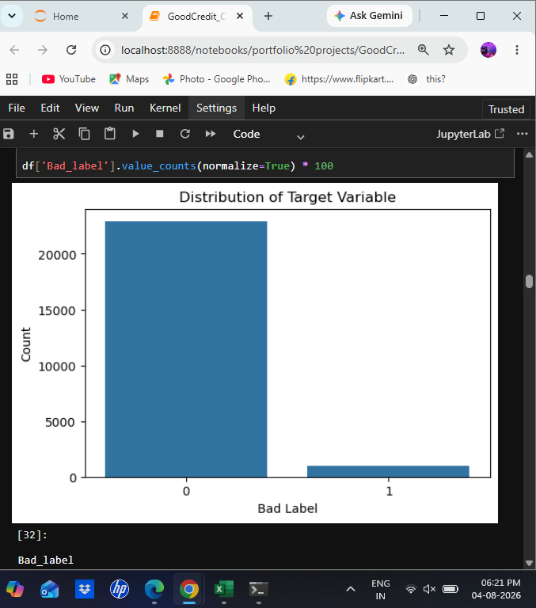
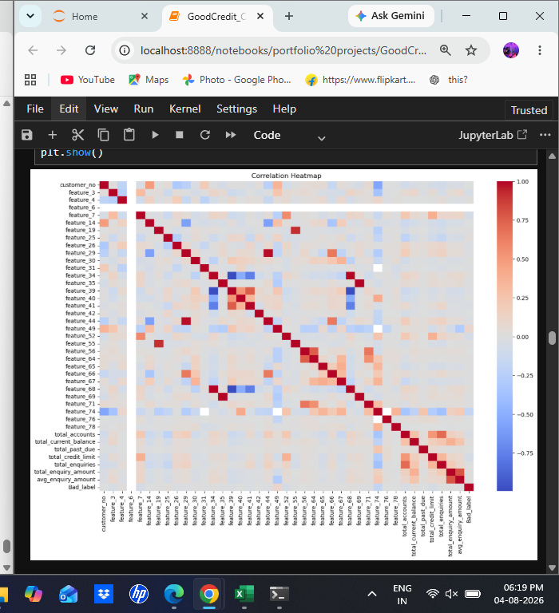
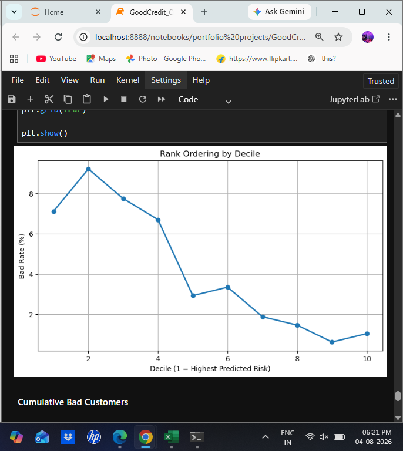
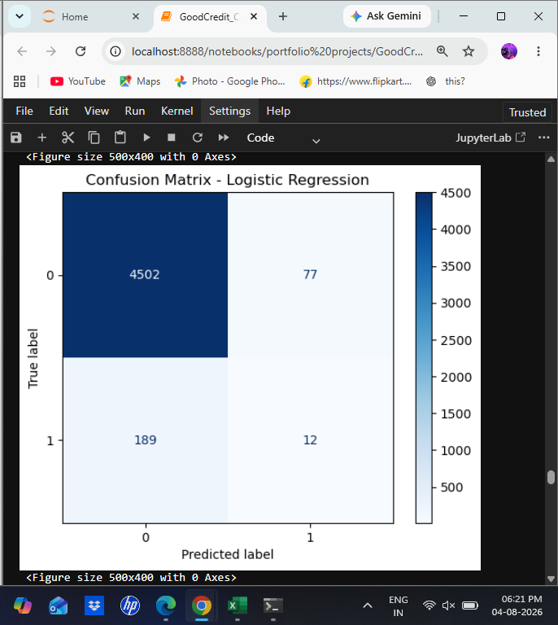

# 💳 Credit Risk Analysis using Machine Learning

## 📌 Project Overview

This project focuses on predicting customer credit risk using Machine Learning techniques. The objective is to classify customers as **Good Credit** or **Bad Credit** based on demographic, account, and enquiry information.

The project was completed as part of my **Data Analytics Internship at Rubixe**, where I worked on a client-based banking analytics problem to build a credit risk prediction model and evaluate its performance using **Gini Coefficient** and **Rank Ordering**.

---

## 🎯 Business Problem

Financial institutions must accurately identify customers who are likely to default on their loans.

Incorrect credit decisions can lead to:

- Increased financial losses
- Higher default rates
- Poor credit portfolio quality

The goal of this project was to build a predictive model capable of distinguishing high-risk customers from low-risk customers using historical customer information.

---

## 📊 Dataset Summary

| Description | Value |
|-------------|-------|
| Total Customers | 23,896 |
| Original Features | 90 |
| Features after Preprocessing | 82 |
| Training Records | 19,116 |
| Testing Records | 4,780 |
| Target Variable | Bad_label |

---

## 🛠️ Technologies Used

- Python
- SQL (MySQL)
- Pandas
- NumPy
- Matplotlib
- Seaborn
- Scikit-learn
- Jupyter Notebook

---

## 📂 Project Workflow

### 1. SQL Data Preparation
- Explored relational tables
- Performed data quality checks
- Aggregated customer account information
- Aggregated enquiry information
- Joined multiple tables
- Created the final customer-level dataset

### 2. Exploratory Data Analysis (EDA)
- Dataset overview
- Missing value analysis
- Duplicate value checks
- Data type inspection
- Target variable distribution
- Correlation analysis
- Outlier detection

### 3. Data Preprocessing
- Missing value treatment
- Date feature extraction
- Encoding categorical variables
- Feature scaling
- Train-Test Split

### 4. Machine Learning Models
- Logistic Regression
- Decision Tree
- Random Forest

### 5. Model Evaluation
- Accuracy
- Precision
- Recall
- F1 Score
- ROC-AUC
- Gini Coefficient
- Rank Ordering (Decile Analysis)

---

## 📈 Model Performance

| Model | Accuracy | ROC-AUC | Gini |
|--------|---------:|--------:|------:|
| Logistic Regression | 94.44% | 0.600 | 0.200 |
| Random Forest | 95.80% | 0.591 | 0.183 |
| Decision Tree | 92.36% | 0.503 | 0.007 |

> Logistic Regression achieved the highest Gini score among the evaluated models.

---

## 📷 Project Screenshots

### Target Variable Distribution



---

### Correlation Heatmap



---

### Rank Ordering



---

### Confusion Matrix



## 📌 Key Findings

- Successfully integrated customer demographic, account, and enquiry data into a unified analytical dataset.
- Performed feature engineering using SQL and Python.
- Built and evaluated multiple classification models.
- Logistic Regression achieved the best discrimination performance with a **Gini Coefficient of 0.200**.
- Rank Ordering demonstrated the model's ability to separate higher-risk customers from lower-risk customers across deciles.

---

## 🚀 Future Improvements

- Handle class imbalance using SMOTE or class weighting.
- Perform hyperparameter tuning.
- Implement advanced boosting algorithms such as XGBoost, LightGBM, or CatBoost.
- Improve feature engineering to achieve the benchmark Gini score.
- Deploy the model using Flask or Streamlit for real-time credit risk prediction.

---

## 📁 Repository Structure

```text
Credit-Risk-Analysis-using-Machine-Learning/
│
├── 01_SQL_Data_Preparation.sql
├── 02_EDA_Model_Building.ipynb
├── GoodCredit_Final_Dataset.csv
├── README.md
├── requirements.txt
└── images/
    ├── target_distribution.png
    ├── corelation_heatmap.png
    ├── confusion_matrix.png
    └── rank_ordering.png
```

---

## 👨‍💻 Author

**Souri Sarkar**

Data Science Consultant Intern @ Rubixe
- GitHub: https://github.com/Souri-Sarkar

